🔐 Cybersecurity Lab Environment Setup
Networkwalks Cybersecurity Internship — Week 1 | Project Module 1


---
📌 Project Overview
This project documents the setup of a controlled cybersecurity testing lab environment using Oracle VirtualBox.
The lab was configured for cybersecurity and ethical hacking practice, with Kali Linux as the primary security testing workstation and additional Windows 10 and Android 9.0 R2 virtual machines for optional VM-to-VM connectivity testing.
The lab network uses a private `10.0.0.0/24` NAT Network.
---
Objectives
The main objectives of this project are to:
Install and configure VirtualBox.
Install/import Kali Linux as a virtual machine.
Create a private NAT Network for the cybersecurity lab.
Configure network connectivity for Kali Linux.
Assign a consistent IP address to the Kali VM.
Verify network connectivity and DNS resolution.
Take a clean VM snapshot for recovery.
Document the complete setup process.
Prepare the environment for future cybersecurity projects.
---
Prerequisites
Recommended laptop/PC specifications for the lab:
8 GB RAM or more
256 GB SSD or more
Core i3/i5 processor or similar
Oracle VirtualBox
7-Zip
Kali Linux virtual machine
Optional: Windows 10/11/7 or Android 9.x virtual machine
> These are the recommended specifications documented in the Networkwalks lab material.
---
Lab Architecture
```text
                         Host Machine
                       Windows 10 Host
                             │
                             │
                    Oracle VirtualBox
                             │
                    ┌────────┴────────┐
                    │   NAT Network   │
                    │  10.0.0.0/24    │
                    │   Gateway       │
                    │    10.0.0.1     │
                    └────────┬────────┘
                             │
          ┌──────────────────┼──────────────────┐
          │                  │                  │
          ▼                  ▼                  ▼
   Kali Linux          Android 9.0 R2       Windows 10
   10.0.0.2/24          10.0.0.9/24         10.0.0.10/24
   Security VM          Optional VM          Optional VM
```
---
⚙️ Lab Configuration
Component	Configuration
Virtualization	Oracle VirtualBox
Network Type	NAT Network
Network Range	`10.0.0.0/24`
Gateway	`10.0.0.1`
DHCP	Disabled
Kali Linux	`10.0.0.2/24`
Android 9.0 R2	`10.0.0.9/24`
Windows 10	`10.0.0.10/24`
Kali Linux Network Requirements
IP address: `10.0.0.2/24`
Gateway: `10.0.0.1`
DNS: `8.8.8.8`
Internet connectivity: Verified
---
🛠️ Lab Setup Procedure
Step 1 — Download & Install 7-Zip
Download and install 7-Zip for extracting virtual machine archives.
Step 2 — Download & Install VirtualBox
Install Oracle VirtualBox on the host laptop/PC.
Step 3 — Create the NAT Network
Create a private NAT Network using:
```text
Network: 10.0.0.0/24
Gateway: 10.0.0.1
DHCP: Disabled
```
The lab VMs are connected to this custom NAT Network.
Step 4 — Download & Import Kali Linux
Download and import the Kali Linux 2026.2 virtual machine into VirtualBox.
The Kali VM is used as the primary security testing workstation.
Step 5 — Configure the Kali IP Address
Configure Kali with the assigned static IP:
```text
IP Address: 10.0.0.2/24
Gateway:    10.0.0.1
DNS:        8.8.8.8
```
Step 6 — Verify Kali Network Configuration
The Kali interface was checked using:
```bash
ip a
```
The expected primary IPv4 address was confirmed as `10.0.0.2/24`.
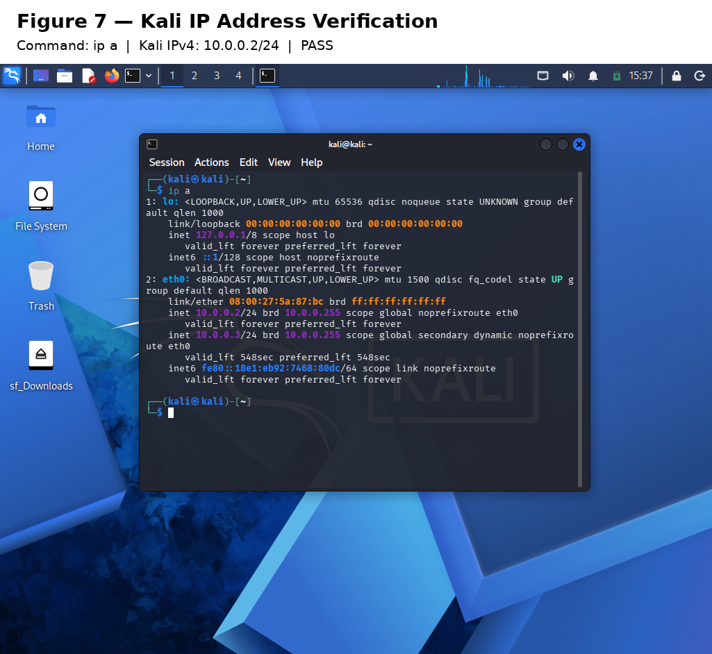
Step 7 — Verify Gateway and Internet Connectivity
Gateway connectivity was tested using:
```bash
ping -c 4 10.0.0.1
```
Internet connectivity was tested using:
```bash
ping -c 4 8.8.8.8
```
Both tests returned 4/4 replies with 0% packet loss.
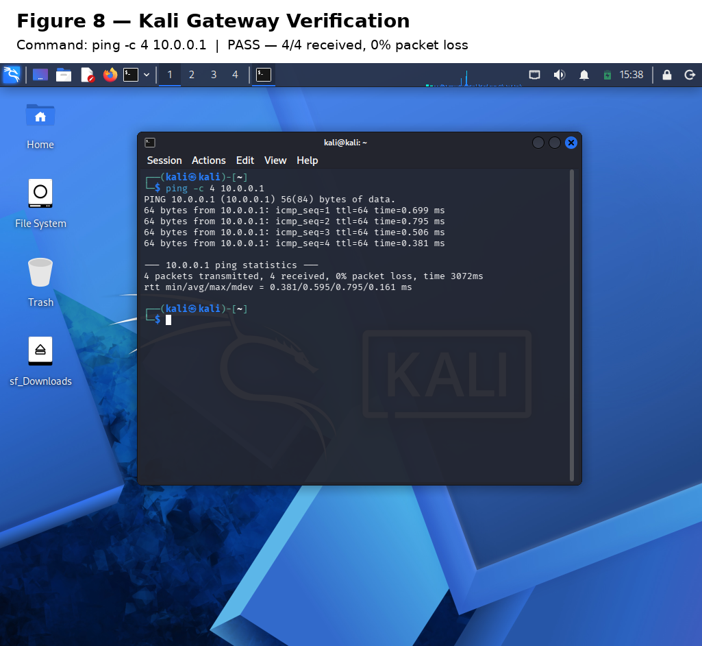
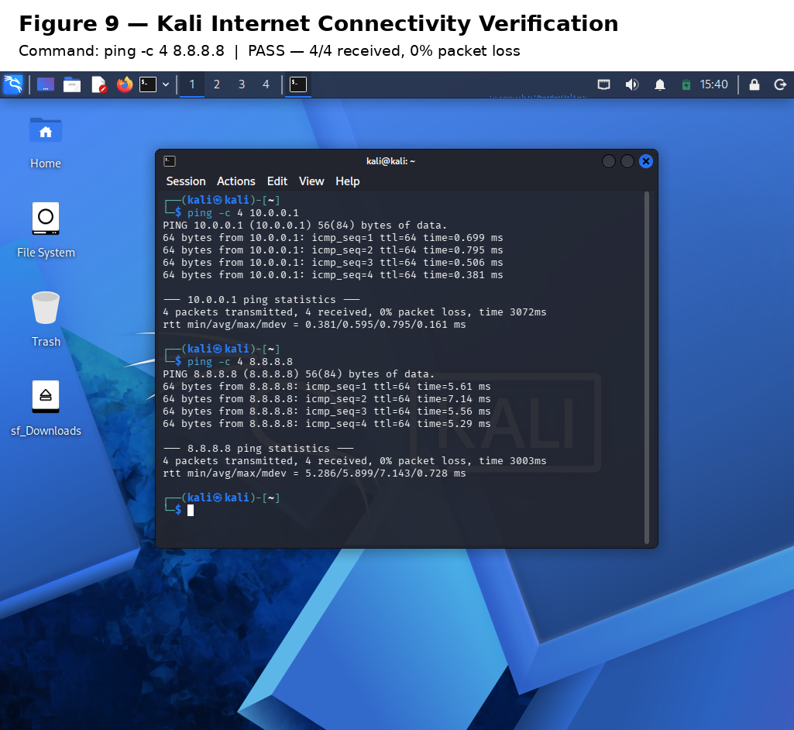
Step 8 — Verify DNS and Nmap
DNS resolution was verified using:
```bash
nslookup networkwalks.com 8.8.8.8
```
The domain resolved successfully to `192.232.216.135`.
Nmap installation was verified using:
```bash
nmap --version
```
Result: `Nmap version 7.99`
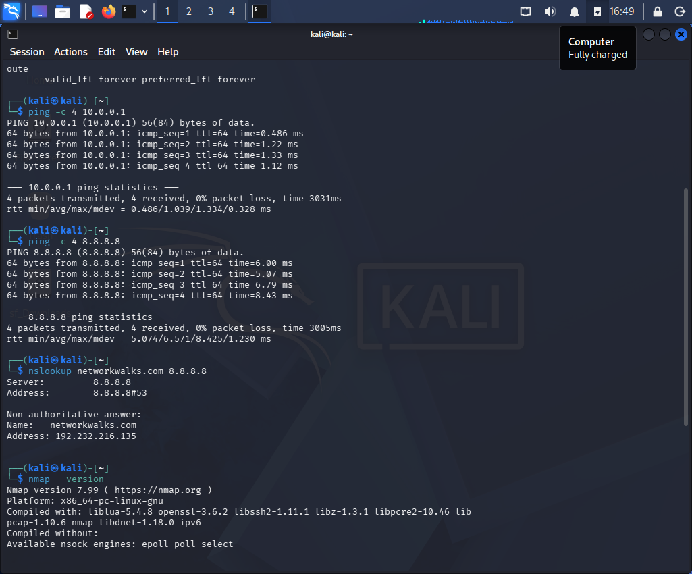
Step 9 — Take a Clean Kali Snapshot
A baseline snapshot named `Week 1 - Lab Setup Complete` was created after the Kali lab setup was completed.
The snapshot was later restored during verification. After the network conflict was corrected, Kali successfully returned to `10.0.0.2/24`.
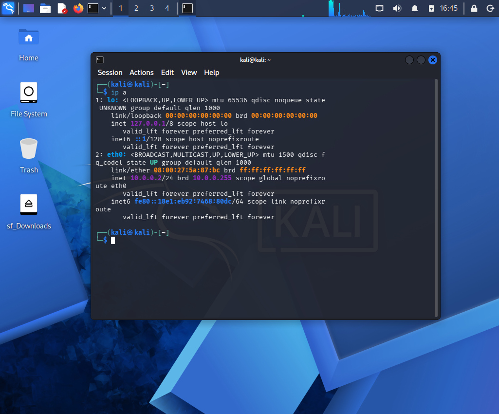
Step 10 — Optional VM Setup
For the optional Phase 2 environment:
Windows 10 was installed.
Android 9.0 R2 was installed.
All three VMs were connected to the same NAT Network.
VM-to-VM connectivity was tested.
Recovery snapshots were used for the virtual machines.
---
Lab Verification
VM-to-VM Ping Tests
Source	Destination	Result
Kali `10.0.0.2`	Android `10.0.0.9`	✅ PASS — 4/4, 0% loss
Android `10.0.0.9`	Kali `10.0.0.2`	✅ PASS — 4/4, 0% loss
Windows `10.0.0.10`	Kali `10.0.0.2`	✅ PASS — 4/4, 0% loss
Windows `10.0.0.10`	Android `10.0.0.9`	✅ PASS — 4/4, 0% loss
Kali `10.0.0.2`	Windows `10.0.0.10`	✅ PASS — 4/4, 0% loss
Android `10.0.0.9`	Windows `10.0.0.10`	✅ PASS — 4/4, 0% loss
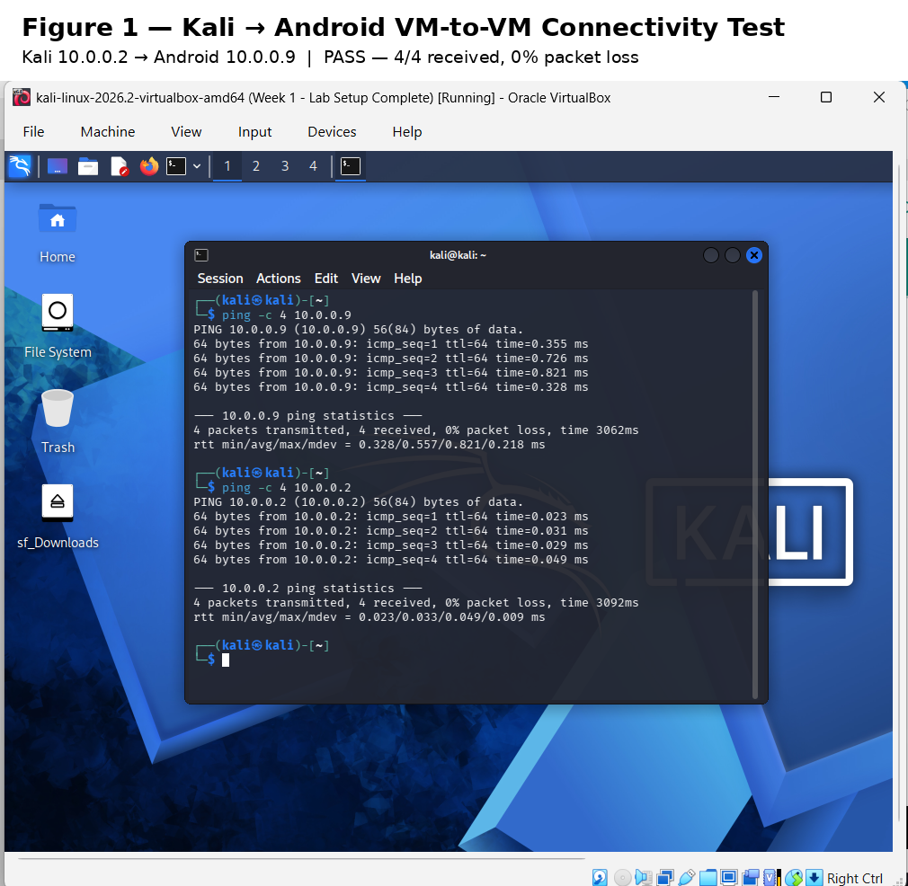
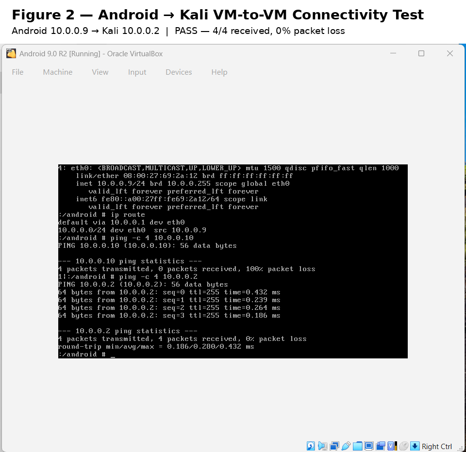
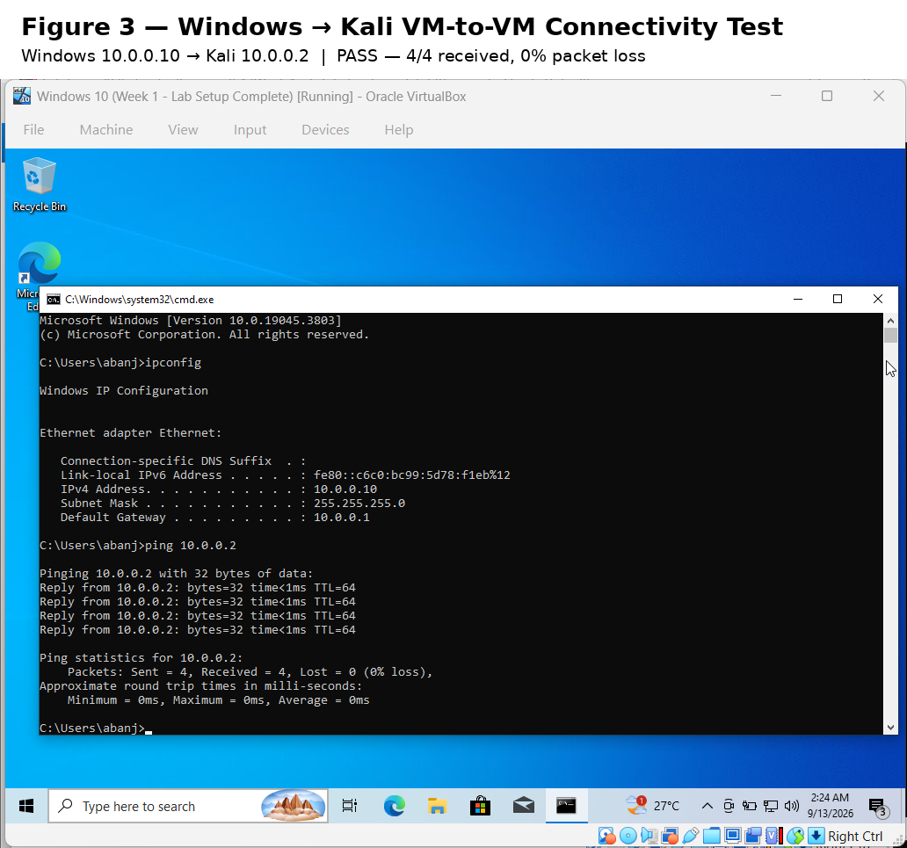
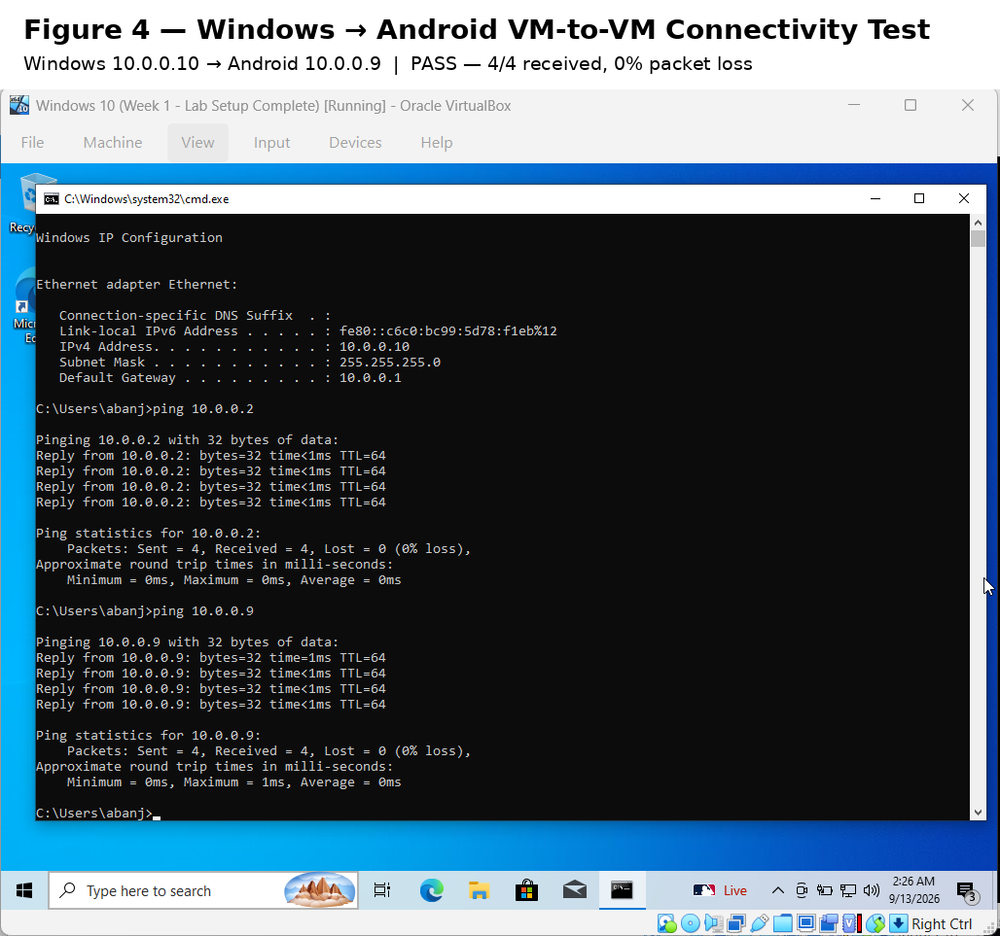
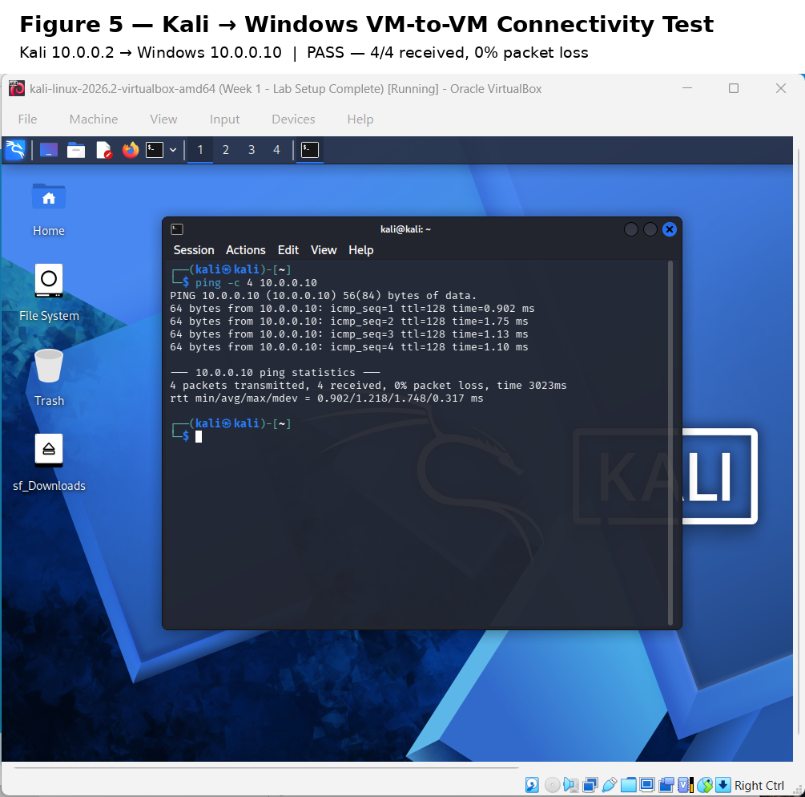
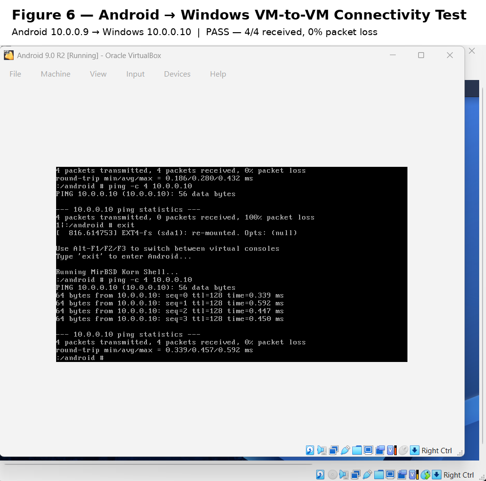
Verification Summary
```text
Kali     ↔ Android     ✅
Kali     ↔ Windows     ✅
Android  ↔ Windows     ✅
```
All six directional VM-to-VM ping tests completed successfully with 0% packet loss.
Kali Verification
Check	Command / Method	Result
Check IP address	`ip a`	`10.0.0.2/24` displayed
Test gateway	`ping -c 4 10.0.0.1`	4/4 replies, 0% packet loss
Test Internet connectivity	`ping -c 4 8.8.8.8`	4/4 replies, 0% packet loss
Test DNS resolution	`nslookup networkwalks.com 8.8.8.8`	Domain resolves
Verify Nmap	`nmap --version`	Nmap 7.99 displayed
Verify snapshot	Restore snapshot and run `ip a`	`10.0.0.2/24` restored
---
Problems & Troubleshooting
Problem 1 — Kali Virtual Disk Inaccessible
Issue: VirtualBox initially reported the Kali VDI as inaccessible/missing.
Investigation: The correct Kali VDI was located in the Downloads directory while a stale inaccessible disk reference remained registered in VirtualBox.
Solution: The stale disk attachment was removed and the correct VDI was attached.
Result: Kali booted successfully.
Problem 2 — Android Installer Could Not Detect Disk
Issue: Android-x86 initially reported that no installation disk was detected.
Investigation: Android debug mode was used to inspect available block devices. `/dev/sda` was confirmed to be visible.
Solution: The Android virtual disk was partitioned and Android-x86 9.0-r2 was installed successfully.
Result: Android booted successfully from the installed virtual disk.
Problem 3 — Android Network Interface
Issue: Android initially had no usable IPv4 configuration in the debug shell.
Investigation: The `eth0` interface and routing table were inspected.
Solution: The lab configuration was applied:
```text
IP:      10.0.0.9/24
Gateway: 10.0.0.1
DNS:     8.8.8.8
```
Result: Android successfully communicated with Kali and Windows.
Problem 4 — Windows Did Not Initially Respond to Ping
Issue: Windows could ping the other VMs, but inbound ICMP echo requests to Windows initially failed.
Investigation: Connectivity from Windows to Kali/Android was successful, while Kali/Android to Windows failed.
Solution: The appropriate Windows ICMPv4 Echo Request inbound rule was enabled in the lab VM.
Result: Kali → Windows and Android → Windows both passed.
Problem 5 — Kali Static IP Conflict After Snapshot Restore
Issue: After restoring the Kali baseline snapshot, Kali initially received `10.0.0.3/24` instead of the expected `10.0.0.2/24`.
Investigation: NetworkManager logs showed that `10.0.0.2` was already in use. VirtualBox NAT Network inspection showed that DHCP was enabled and its DHCP service was using `10.0.0.2`.
Solution: DHCP was disabled on `NatNetwork`:
```cmd
VBoxManage natnetwork modify --netname NatNetwork --dhcp off
```
Result: After restarting Kali, the expected static address `10.0.0.2/24` was restored. Gateway, Internet, DNS, Nmap, and snapshot verification tests then passed.
---
What I Learned
1. Virtual Machine Setup
Learned how to create, configure, attach virtual disks, and troubleshoot virtual machines in VirtualBox.
2. Network Configuration
Learned how to configure IPv4 addressing, subnet masks, gateways, DNS, and NAT Network connectivity.
3. Linux Networking
Used Linux networking commands to inspect interfaces and routing and to verify connectivity.
4. Troubleshooting
Learned to isolate problems by testing connectivity in different directions instead of changing multiple settings at once.
5. Windows Firewall
Learned how inbound firewall rules can affect ICMP connectivity even when outbound connectivity works.
6. DHCP and Static IP Conflicts
Learned how an incorrectly enabled NAT Network DHCP service can conflict with a statically assigned lab IP address.
7. Evidence & Documentation
Learned how to capture test results, document troubleshooting steps, and maintain reproducible lab evidence.
---
Security & Ethical Use
This project was completed as part of a controlled cybersecurity training environment.
All security testing and experimentation must remain within authorized systems and approved lab environments.
Never apply testing techniques to systems without explicit authorization from the owner.
---
Tools & Resources
Tools
Oracle VirtualBox
Kali Linux 2026.2
Windows 10
Android-x86 9.0 R2
7-Zip
`ping`
`nslookup`
Linux networking utilities
NetworkManager / `nmcli`
Nmap
Windows Firewall
Resources
Networkwalks Week 1 Project Module 1 lab material
Official Oracle VirtualBox documentation
Official Kali Linux resources
Android-x86 documentation
---
👤 Author
Jerose N. Aban  
Cybersecurity Professional B083F
Networkwalks
---
